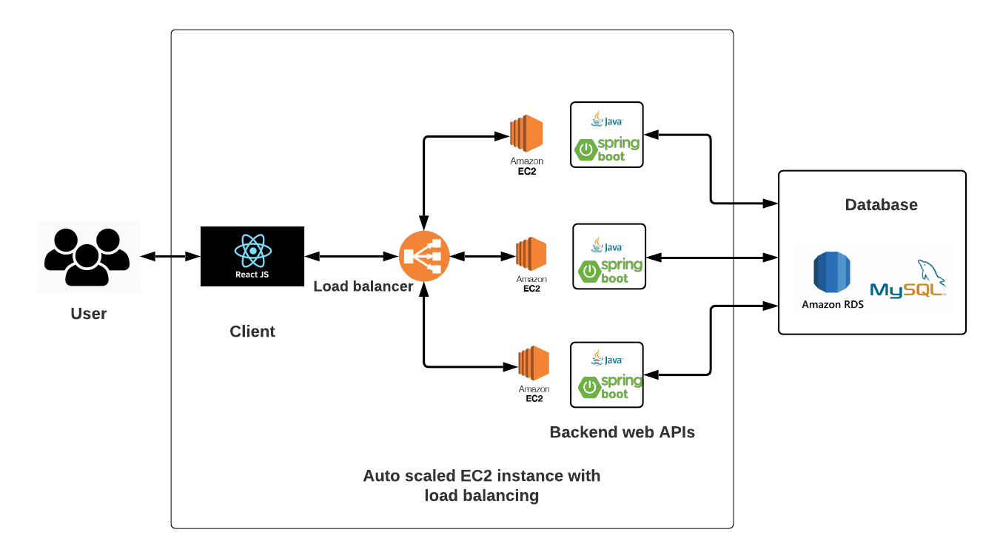
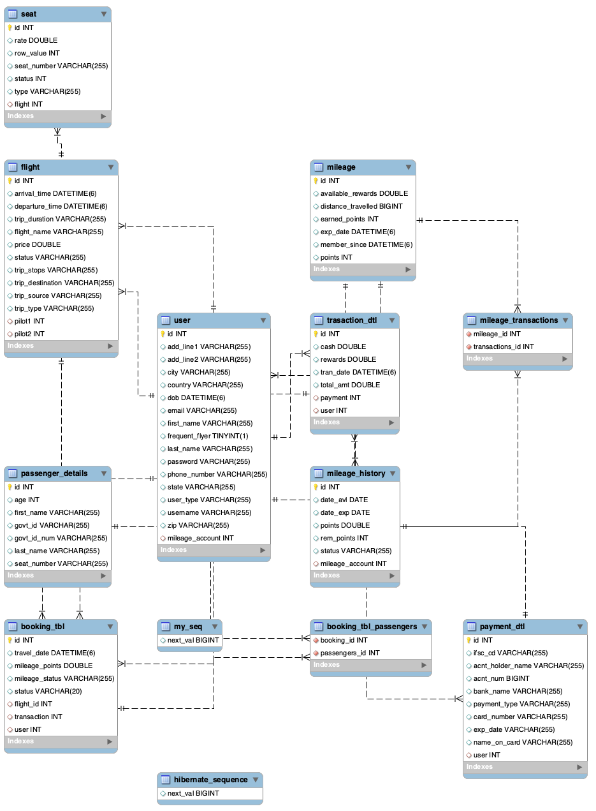

# Flight Reservation System (The Team)

## Team Members
* Akash Kuratkar (013534118)
* Sherin Thlakulathil Elias
* Veena Mamidi
* Sai Sravani Chalasani

## Technology Stack
* Frontend - ReactJS,BootStrap,MaterialUI,HTML/CSS
* Middleware - Java 8, SpringBoot, JPA(ORM), REST APIs
* Backend - MySQL Database
* Version Control: Git
* Task Management: JIRA

## Architecture Diagram

## Database Schema

## High-level Module Ownership
* Akash Kuratkar - Mileage Account, Employee Portal(Add/Edit Flights)
* Sherin Thlakulathil Elias - Flight Search, Purchase seats and book travel.
* Veena Mamidi - Edit/Cancel Flight, User Profile
* Sai Sravani Chalasani - User Login/Registration

## Scrum Event
### Scrum Meeting - Every Friday

## Srcum Report
### Total Sprints 9 (10/01/2021 - 12/02/2021)
* Sprint 1(10/01 - 10/08) -  
* Sprint 2(10/09 - 10/15) -  
* Sprint 3(10/15 - 10/21) -  
* Sprint 4(10/22 - 10/28) -  
* Sprint 5(10/29 - 11/05) -  
* Sprint 6(11/06 - 11/12) - 
* Sprint 7(11/12 - 11/18) -  
* Sprint 8(11/19 - 11/25) -  
* Sprint 9(11/26 - 12/02) - 

